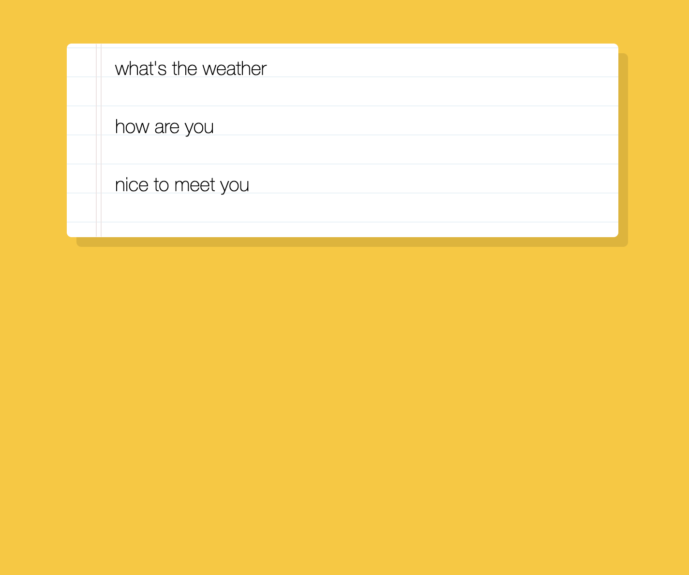

# speech_detection

This is a 30-days javascript grinding  
js30 [https://github.com/ningh98/js30]  
20. speech detection [https://github.com/ningh98/speech_detection]

## Table of contents

- [Overview](#overview)
  - [Screenshot](#screenshot)
  - [How to use](#how-to-use)
- [My process](#my-process)
  - [Built with](#built-with)
  - [What I learned](#what-i-learned)

## Overview

This document creates a simple web page for real-time speech detection and transcription using the Web Speech API.

### Screenshot

### How to use

- Download all files
- npm install
- npm start
- open it in the browser and allow localhost to use microphone

## My process

### Built with

- HTML
- CSS
- Javascript

### What I learned

how to use js to work with speech detection